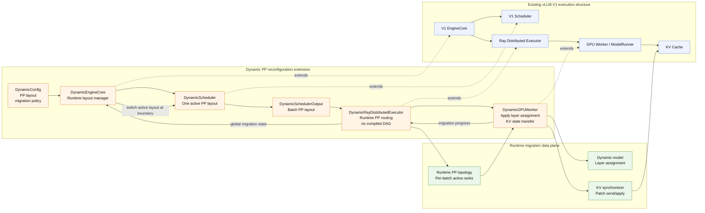
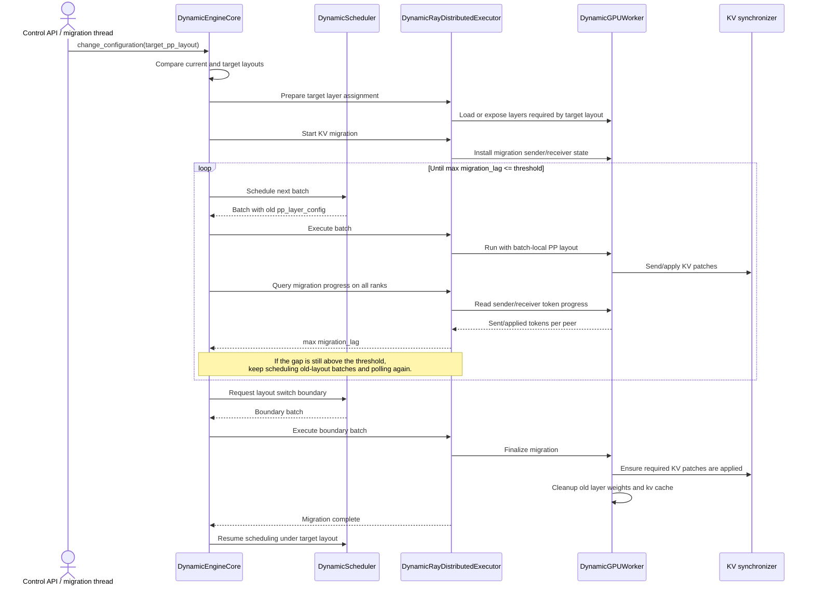
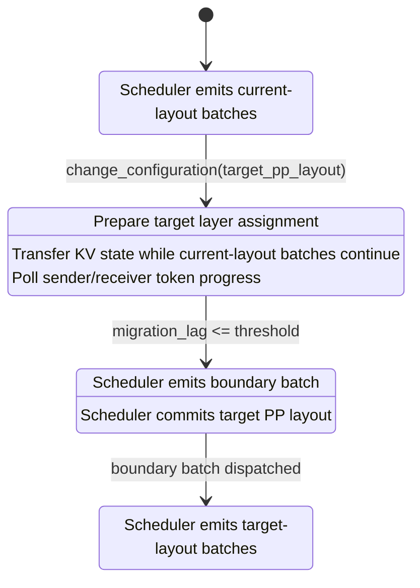

{ #dynamic-pp-migration-architecture }

# Dynamic Pipeline-Parallel Reconfiguration

This document describes an experimental extension to vLLM V1 that makes the
pipeline-parallel layout reconfigurable at runtime. The goal is to support
pipeline-parallel reconfiguration.

In upstream vLLM, the pipeline-parallel layout is effectively fixed for the
lifetime of the engine. This extension turns the layout into runtime state. A
configuration change can move layers between ranks, activate or deactivate
pipeline ranks, and migrate the associated KV state so that in-flight requests
remain consistent across the transition.

## Terminology

This document uses a small set of terms consistently:

- **PP layout**: the runtime mapping from pipeline ranks to layer ranges. Empty
  ranges represent inactive ranks.
- **Layer assignment**: the set of model layers a worker rank should run under a
  given PP layout.
- **KV state transfer**: the movement of KV cache state required when the PP
  layout changes.
- **Migration boundary**: the point where the scheduler commits the target PP
  layout for new batches.

## Architecture Overview

The following diagram highlights the extension boundary. The blue area is the
existing vLLM V1 execution structure. The orange area is the dynamic
reconfiguration control plane. The green area is the runtime data plane needed
to update layer assignment and transfer KV state.

In the prototype implementation, most `Dynamic*` components are implemented as
extensions of their corresponding vLLM V1 components. For example,
`DynamicScheduler` inherits most of the scheduler interface and behavior, then
adds or overrides the parts needed for runtime PP layout changes. The diagram
therefore distinguishes between the upstream component being extended, such as
`V1 Scheduler`, and the dynamic component that carries the experimental
reconfiguration behavior, such as `DynamicScheduler`.

## Component Responsibilities

`DynamicConfig` is a new configuration component added to `VllmConfig`, rather
than a subclass of an existing execution component. It carries experimental
dynamic settings such as PP layer partitioning, migration configuration paths,
and autoscaling-related knobs.

`DynamicEngineCore` extends the V1 `EngineCore`. It owns the runtime
reconfiguration lifecycle: receiving the target PP layout, deciding when a
migration is needed, coordinating the executor and scheduler, and committing the
target layout once the consistency boundary is reached.

`DynamicScheduler` extends the V1 `Scheduler`. It keeps scheduling requests
under a single active PP layout. During migration it can emit batches that still
belong to the old layout, and it only changes the active layout when the engine
reaches the boundary batch.

`DynamicSchedulerOutput` is a dynamic counterpart to the V1 `SchedulerOutput`.
In the current prototype it is a separate dataclass, not a Python subclass. It
carries the normal scheduler output fields plus the batch-local PP layout and
migration metadata, so workers execute according to the batch-local layout
rather than assuming a single static global layout.

`DynamicRayDistributedExecutor` extends the V1 `RayDistributedExecutor`. It
coordinates distributed workers and runtime PP routing. This path intentionally
does not use a compiled DAG for PP execution: the active PP stages and their
connections can change at runtime, so the executor derives the PP topology from
the batch-local layout instead of relying on a static execution graph.

`DynamicGPUWorker` extends the V1 `Worker`. It performs the worker-local part of
the change: updating layer assignment, participating in KV state transfer,
applying KV patches, and finalizing local state after the migration boundary.

The KV migration path is part of the correctness model, not an optimization.
Changing layer assignment without transferring the corresponding KV state is not
enough to preserve request execution across a PP layout change.

## Migration Sequence

The runtime transition has two important properties:

First, old-layout batches are allowed to continue using the layout they were
scheduled with. Second, the scheduler only starts emitting target-layout batches
after the migration boundary. In the current prototype, the engine decides when
to request that boundary by repeatedly polling all ranks for KV-transfer
progress. Once the gap between the latest generated migration token and the
sender/receiver transfer progress is below a threshold, the engine asks the
scheduler to emit the boundary batch.

## Layout Switch Boundary

The layout switch is a single boundary event. Before the boundary, newly
scheduled batches still use the current PP layout. After the boundary, newly
scheduled batches use the target PP layout.

## Autoscaling Model

Autoscaling is a specific case of PP reconfiguration where the set of active
ranks changes. A shrink operation is represented as a target PP layout where
some ranks become inactive because their layer ranges are empty. An expand
operation assigns non-empty layer ranges to previously inactive ranks.
Therefore, autoscaling shares the same control logic for KV state transfer,
weight loading, and PP layout propagation as regular PP reconfiguration, with
additional logic to manage ranks that join or leave during autoscaling.
